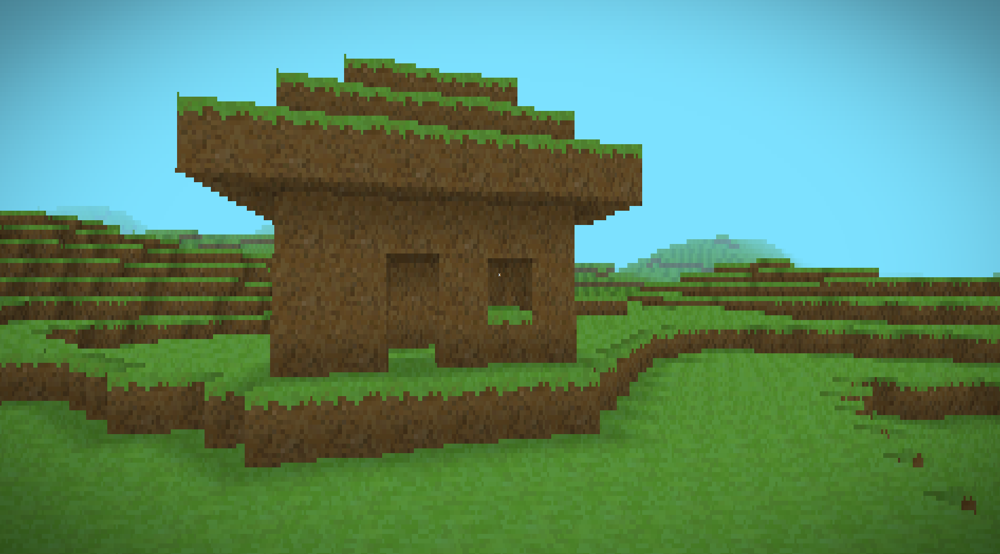
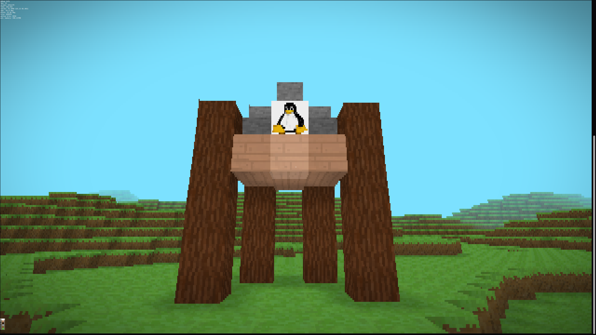

# TermCraft
A 3D Minecraft clone running in the terminal.

This is quite a minimal implementation and [many features](doc/TODO.md) are still planned.

| House | Tux Shrine |
|:-----:|:----------:|
|  |  |

---

## Index
- [Build Instructions](#build-instructions)
- [Keybinds](#keybinds)
- [Troubleshooting](#troubleshooting)
    - [Error Codes](#error-codes)
    - [Graphics](#graphics)
    - [Performance](#performance)
- [Command Line Parameters](#command-line-parameters)
    - [Settings](#settings)
    - [Flags](#flags)
- [License](#license)

---

## Build Instructions
Compile the project with cmake:  
```
mkdir build
cd build
cmake path/to/termcraft
make
```
The executable must be run in a command line!

---

## Keybinds
It is recommended to turn off the delay on repeat keys in the system settings (probably under the keyboard or accessibility section). Try to quit using `q` rather than `ctrl-c` whenever possible to ensure a clean exit.

`w` `a` `s` `d`: Movement  
`i` `j` `k` `l`: Look/Turn  
`space`: jump / fly up  
`c`: toggle crouch / fly down  
`x`: toggle between walk and fly  
`p`: toggle sprint  
`e`: break block  
`f`: place block  
`1`-`9`: select block in hand  
`q`: quit

---

## Troubleshooting

### Error Codes
When TermCraft exits or crashes in a controlled manner, it will print the following message:  
`Engine exited with code x`.  
Additionally, if there was an error, a message will be printed containing details about the error and sometimes a possible solution as well.  
Here are all error messages associated with the values for `x`.

| Code | Error | Possible Solution |
| ---- | ----- | -------- |
| 0 | Success | N/A |
| 2 | Failed to get terminal size and/or open pipe with `popen("tput cols; tput lines", "r"))` | `--fixed-window-size` |
| 4 | Failed to set cursor to position zero (command: `tput cup 0 0`) |  |
| 5 | Failed to make cursor invisible (command: `tput civis`) | `--cursor-visible` |
| 6 | Input setup failed (command: `stty -echo cbreak`) |  |
| 7 | Failed to clear the terminal window (command: `tput clear`) |  |
| 8 | Failed to reset cursor to normal mode (command: `tput cnorm`) | `--cursor-visible` |
| 9 | Failed to reset input to normal mode (command: `stty echo -cbreak`) |  |
| 10 | Failed to read terminal size from pipe with `fscanf(...)` | `--fixed-window-size` |

If TermCraft crashes by printing `Killed`, the system likely ran out of memory and you should set the world size smaller (parameter `world-size`).  

In any other case, feel free to open an issue.

### Graphics
If the graphics look like a cat walked over your keyboard or look wrong in any other way, make sure that your terminal supports full rgb color (most terminals do). If you can't get it to work, you can also use `color-mode COMPAT`. This will make everything black-and-white with low dynamic range. If that still doesn't work, you can use `color-mode ASCII` (*possible permanent eye damage warning*).

### Performance
You can see useful info (fps, estimated memory usage etc.) by running with the `--debug-info` flag.
The biggest factors affecting performance are:

- Render distance (parameter `render-distance`)
- Viewport size (parameters `--fixed-window-size`, `width`, `height`)
- Caves (parameter `--no-caves`)

---

## Command Line Parameters
Here are all parameters you can pass to TermCraft in the command line. Note that a *setting* must be followed by a value while a *flag* must not.

### Settings
| name | type | default value | description |
| ---- | ---- | ------------- | ----------- |
| `color-mode` | string | `FULL` | Can be one of: `FULL` (full rgb color); `COMPAT` (grayscale with low dynamic range); `ASCII` (display letters, numbers and symbols to indicate brightess (*possible permanent eye damage warning*)) |
| `fog` | float | `0.5` | Fog factor between 0.0 and 1.0 (0.0 = no fog; 1.0 = fog gradient comes up to camera) |
| `fov` | float | `70` | Field of view in degrees |
| `fps` | int | `24` | Target fps / fps cap |
| `height` | int | `24` | Height of viewport in pixels, if `--fixed-window-size` is set |
| `render-distance` | float | `100` | Render distance in blocks |
| `sky-color` | hex | `0x7ce1ff` | Color of the sky and fog (note the `0x` instead of `#`) |
| `start-time` | float | `10` | Starting time of day in hours (24-hour clock) |
| `time-scale` | float | `60` | Speed factor of time of day compared to real life time (`1` = real life; `60` = 1 real life minute is 1 in-game hour) |
| `width` | int | `80` | Width of viewport in pixels, if `--fixed-window-size` is set |
| `world-size` | int | `10` | World width in both X and Z directions in chunks (`world-size`*16 blocks) |

### Flags
| name | description |
| ---- | ----------- |
| `--bad-normals` | Show frontfacing triangles in blue, backfacing in red (similar to Blender); Turn backface culling off |
| `--cursor-visible` | Make the terminal cursor visible (hidden by default); Fix error codes 5 and 8 |
| `--debug-info` | Show useful info as part of the HUD |
| `--disable-textures` | Use flat colors instead of textures |
| `--fixed-window-size` | Enable the `width` and `height` settings (if not set: automatic window size) |
| `--help` | Display a similar help message to these tables and exit |
| `--hide-hud` | Disable the HUD (inventory and controller state indicators) |
| `--no-caves` | Disable cave generation (slightly improves performance) |
| `--noclip` | When in fly mode, disable collisions (not in walk mode, so that you don't fall through the ground) |

### License
TermCraft is licensed under the [MIT License](LICENSE). Thanks to lewing@isc.tamu.edu Larry Ewing and The GIMP for the tux easteregg!
